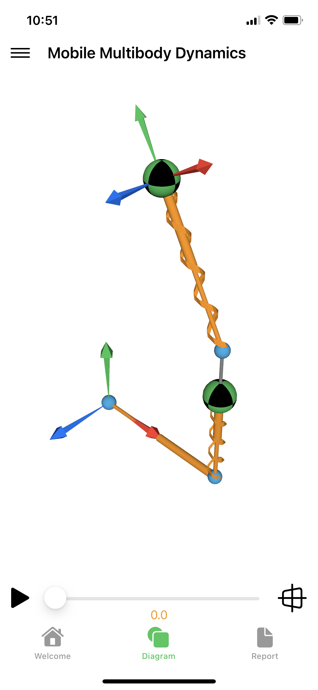
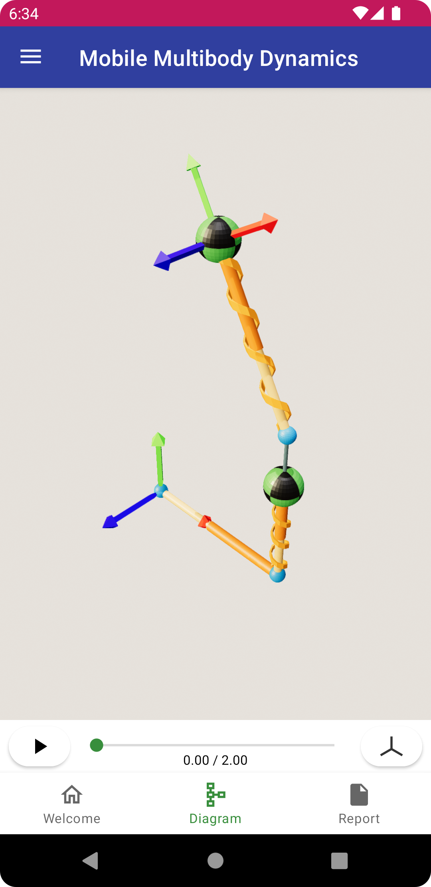
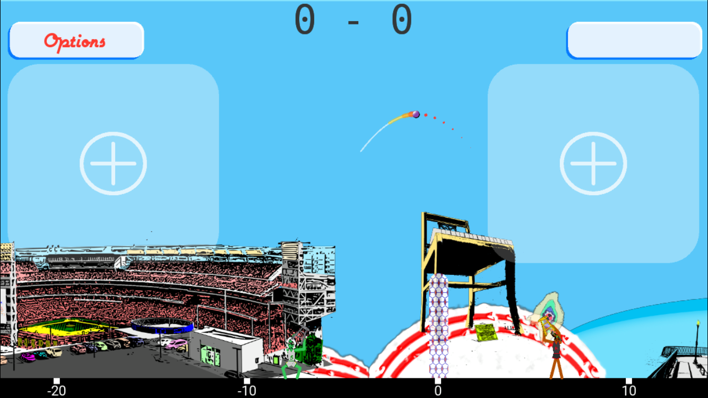
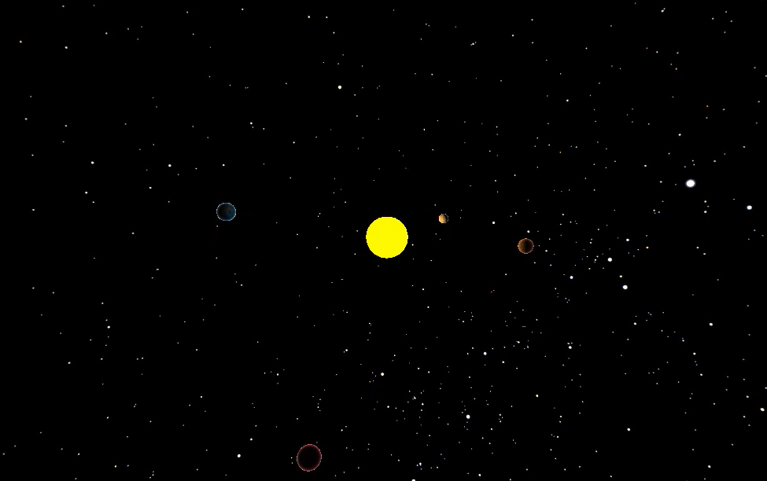
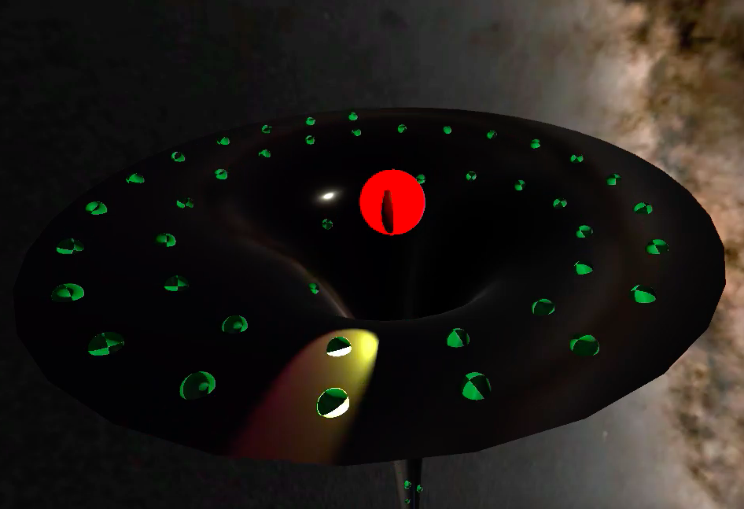
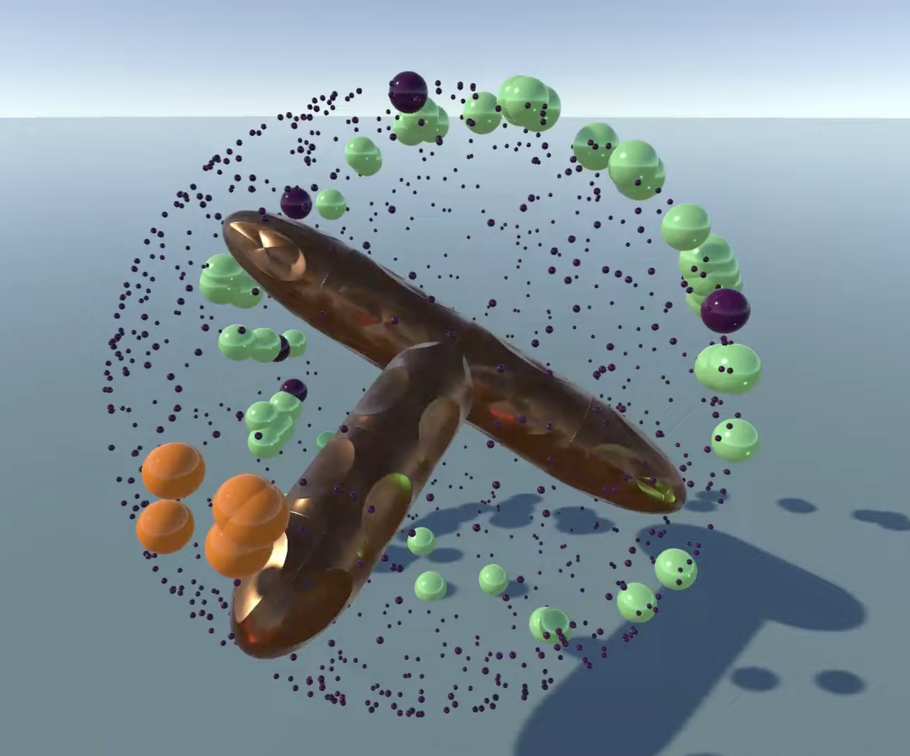
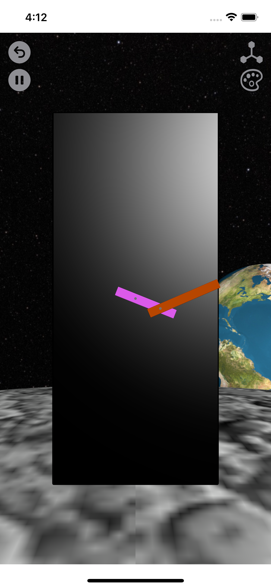
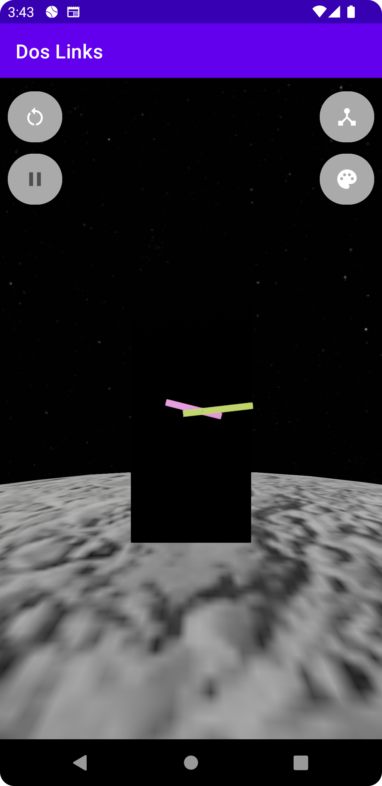
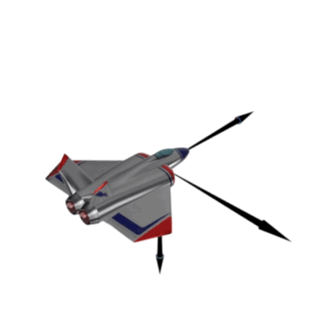

# Summary

- Hi, I’m @radcli14, an aerospace and mechanical engineer, specialized in dynamics (physics of motion)  
- My [resumé](https://radcli14.github.io/resume/) is hosted on GitHub and created in Markdown text
- I’m interested in mobile application development and 3D graphics
- I am skilled in writing data analysis and simulation code in MATLAB and Python
- I have released several applications on the App Store and Google Play, and am familiar in native Swift and Kotlin programming
- I’m currently learning Unity and C#

# Projects 

## Mobile Multibody Dynamics
"MOMDYN" is a long term personal project of mine, and is the first ever multibody dynamics app on mobile devices.
My vision is that this app, and other concepts I'm considering, fill an un-tapped market for useful engineering applications that students and professionals can access while on-the-go, whenever their creativity strikes.
Originally created in pure Python, using the Kivy framework, I have since ported to native code using Python for the scientific back-end.
Notably, combining Python and Swift is a major challenge, and in the process I developed the Bee Swift repository, which I believe to be the only existing clear procedure that explains how to combine Python and SwiftUI.
MOMDYN is currently available on both the App Store and Google Play.

| Native iOS With SwiftUI and SceneKit  | Native Android with Kotlin and Filament.  |
|---------------------------------------|-------------------------------------------|
|  |  |

## dRuBbLe
dRuBbLe is the first app I ever released, based on a game we used to play in real life when I was in college.
We would take bar stools and try to run and bounce a kickball off of the top of the stools for as far of a distance as we could across a parking lot.
[The original version](https://github.com/radcli14/drubble) was written in pure Python using the multiplatform framework [Kivy](https://kivy.org/) to deploy on iOS and Android.
I have recently started re-writing a [3D version](https://github.com/radcli14/D3) of the game in Unity.

| dRuBbLe in Python with Kivy                 | dRuBbLe in Unity                      |
|---------------------------------------------|---------------------------------------|
|  |  |

## Real-Time Simulation in Unity for Scientists and Engineers
In fall of 2022 I took an 8 week course in Unity that is offered by my workplace.
As we are aerospace engineers (not game developers), the course focused on the attributes of the Unity engine that are useful to the hard sciences.
In particular, an emphasis was placed on scripting and the C# programming language.
My own interest was in evaluating the built-in physics engine, with focus on its capacity to accurately simulate dynamics.
Unfortunately, I came away with the impression that the physics engine only "looks" real, its not viable as an engineering tool on its own.
However, I did gain experience in writing my own, accurate simulation models in the C# language, and rendering them in 3D.
I have since applied the knowledge gained in my professional job, creating lifelike visualizations of rocket launches using kinematic states estimated from accelerometers.

| All The Planets                           | Bouncy Attractors                            |
|-------------------------------------------|----------------------------------------------|
|  |  |

| Gravity Well                            | Spinning Wrench                            |
|-----------------------------------------|--------------------------------------------|
|  |  |

## Two Links
During a period of time where I was binging double-pendulum videos on Youtube, I thought I should make my own version of one in app form.
The physics of the double pendulum were initially evaluated in a Jupyter notebook using the Python `sympy.physics.mechanics` module.
These equations were then translated into Swift and Kotlin code, and user interface was developed for iOS and Android.
A user can control the dimension of the pendulum, and its colors.
In the background is the moon and Earth.

| Swifty TwoLinks                         | KotlyOtly DobleDosLinks                     |
|-----------------------------------------|---------------------------------------------|
|  |  |

## Euler Rotations in 3-Dimensions
While putting together a presentation on dynamics for aerospace applications, my team created a slide on 3D kinematics and Euler angles.
The math and stationary diagrams were not particularly intuitive, which inspired me to create my own visualization.
The iOS app includes slider bars to control yaw, pitch, and roll angles, which are animated using three frames and a spaceship.

