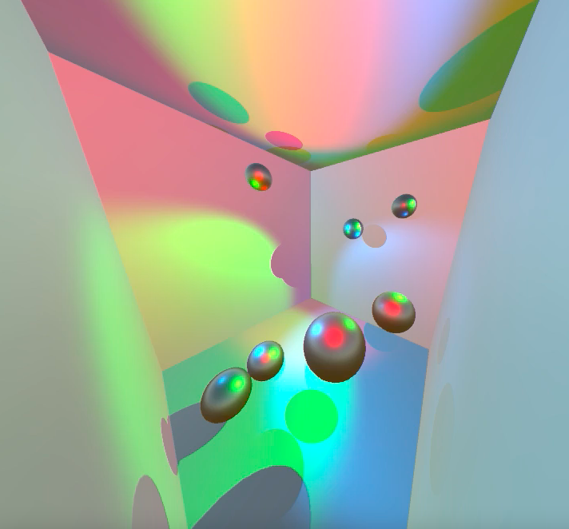

- Hi, I’m @radcli14, an aerospace and mechanical engineer, specialized in dynamics (physics of motion)  
- I’m interested in mobile application development and 3D graphics
- I am skilled in writing data analysis and simulation code in MATLAB and Python
- I have released several applications on the App Store and Google Play, and am familiar in native Swift and Kotlin programming
- I’m currently learning Unity and C#

## Mobile Multibody Dynamics

| Native iOS With SwiftUI and SceneKit  | Native Android with Kotlin and Filament.  |
|---------------------------------------|-------------------------------------------|
|  |  |

## Real-Time Simulation in Unity for Scientists and Engineers

| All The Planets                           | Bouncy Attractors                            |
|-------------------------------------------|----------------------------------------------|
|  |  |

| Gravity Well                            | Spinning Wrench                            |
|-----------------------------------------|--------------------------------------------|
|  |  |
